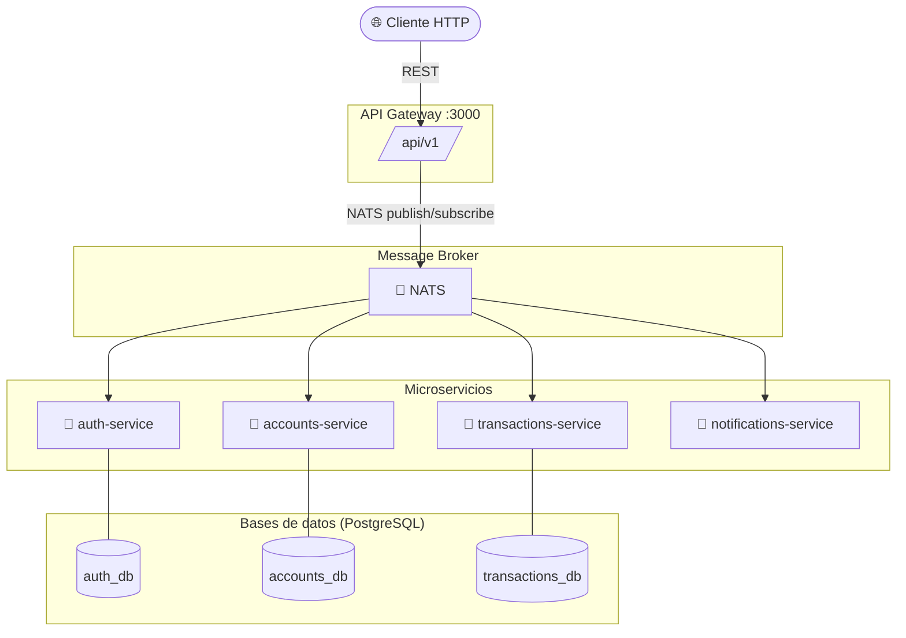
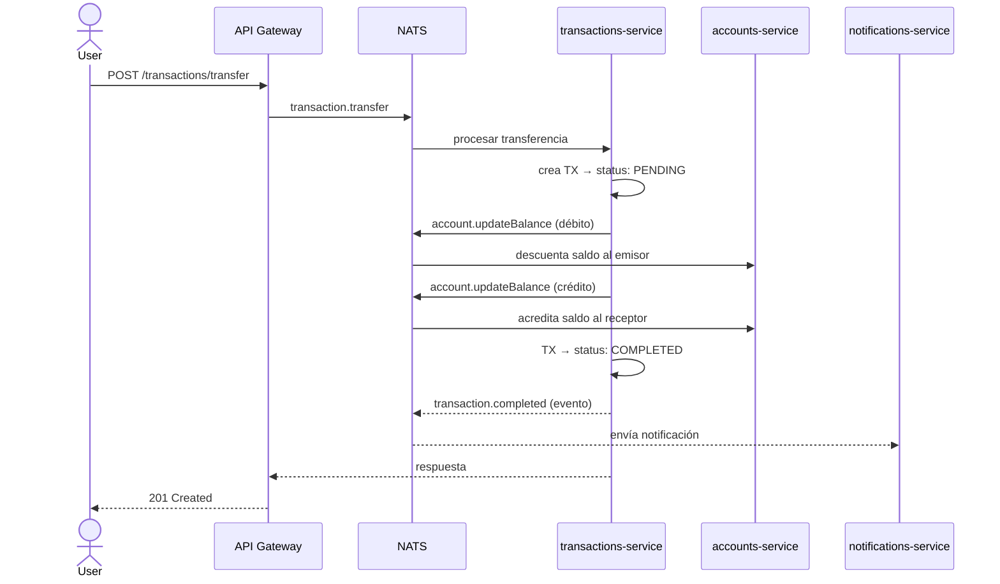

# 💳 Wallet Microservices

<p align="center">
  
  
  
  
  
</p>

Billetera digital simulada construida con arquitectura de **microservicios**. Cada servicio tiene su propia base de datos y se comunica de forma asíncrona a través de **NATS**.

---

## 🏗️ Arquitectura



---

## 🔄 Flujo de transferencia



---

## 📦 Servicios

| Servicio | Responsabilidad | Puerto interno | DB |
|---|---|---|---|
| `api-gateway` | Punto de entrada HTTP, validación JWT | `3000` | — |
| `auth-service` | Registro, login, generación de JWT | NATS | `auth_db` |
| `accounts-service` | Cuentas y saldos | NATS | `accounts_db` |
| `transactions-service` | Transferencias e historial | NATS | `transactions_db` |
| `notifications-service` | Notificaciones de eventos | NATS | — |

---

## 🚀 Levantar el proyecto

### Requisitos
- [Docker Desktop](https://www.docker.com/products/docker-desktop/)
- Node.js 20+

### Con Docker (recomendado)

```bash
docker compose up --build -d
```

Todos los servicios, bases de datos y el broker levantan automáticamente.

### Desarrollo local

```bash
npm install
# Levantar solo la infraestructura
docker compose up nats postgres-auth postgres-accounts postgres-transactions -d
# Correr un servicio en watch mode
npm run start:dev auth-service
```

---

## 📡 API Endpoints

Base URL: `http://localhost:3000/api/v1`

### Auth
| Método | Endpoint | Auth | Descripción |
|---|---|---|---|
| `POST` | `/auth/register` | ❌ | Registrar usuario |
| `POST` | `/auth/login` | ❌ | Login, retorna JWT |

### Accounts
| Método | Endpoint | Auth | Descripción |
|---|---|---|---|
| `POST` | `/accounts` | ✅ | Crear cuenta |
| `GET` | `/accounts/balance` | ✅ | Ver saldo |

### Transactions
| Método | Endpoint | Auth | Descripción |
|---|---|---|---|
| `POST` | `/transactions/transfer` | ✅ | Transferir fondos |
| `GET` | `/transactions/history` | ✅ | Historial de movimientos |
| `GET` | `/transactions/:id` | ✅ | Detalle de transacción |

---

## 🧱 Principios aplicados

- **SOLID**: cada servicio tiene una única responsabilidad y depende de abstracciones (NATS), no de implementaciones concretas.
- **Database per Service**: cada microservicio tiene su propia base de datos aislada.
- **API Gateway pattern**: único punto de entrada que centraliza autenticación y enrutamiento.
- **Event-driven**: las notificaciones se disparan mediante eventos asíncronos, sin acoplamiento directo.

---

## 🛠️ Stack

- **Framework**: NestJS (monorepo)
- **Lenguaje**: TypeScript
- **Mensajería**: NATS
- **ORM**: TypeORM
- **Base de datos**: PostgreSQL
- **Contenedores**: Docker Compose
- **Auth**: JWT (jsonwebtoken)
